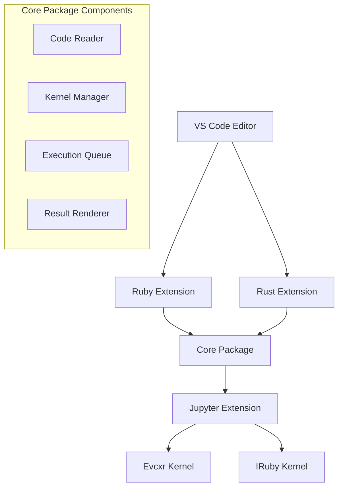
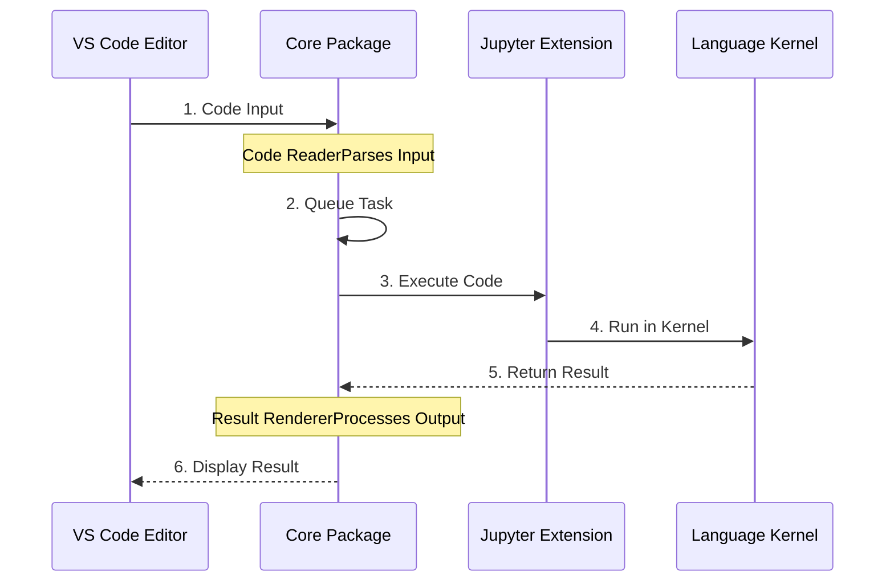

:::message
この記事は [Rust アドベントカレンダー 2024](https://qiita.com/advent-calendar/2024/rust) および [フィヨルドブートキャンプ Advent Calendar 2024](https://adventar.org/calendars/10357) の 25 日目の記事です。
:::

# はじめに

プログラミング言語の学習や開発において、REPL は非常に強力なツールです。特に Rust のような静的型付け言語では、コードの動作を素早く確認できる REPL の存在は、開発効率を大きく向上させます。

私は開発において以下のような課題を感じており、これを解決するために VS Code 向けのインライン REPL 拡張機能の開発を始めました：

1. **エディタ機能との統合**

   - VS Code で Rust Analyzer の提供する高度な補完や型情報、定義ジャンプなどの機能を活かしながら REPL を使用したい
   - コンソール上の Evcxr では補完機能がなく、Jupyter Notebook 上では VS Code の IntelliSense による基本的な補完はあるものの、Rust Analyzer の高度な機能は使えない

2. **開発フローの改善**

   - 従来の REPL では別ウィンドウでの操作が必要
   - エディタと REPL の行き来をよりスムーズに

3. **インライン REPL の選択肢拡大**
   - Rust のインタラクティブな実行環境は主に以下の選択肢がある：
     - evcxr_repl（スタンドアロン REPL）
     - Jupyter 環境での evcxr_jupyter
       - Jupyter Notebook
       - VS Code Jupyter 拡張機能（Notebook エディタまたは Interactive Window）
   * VS Code では他の言語向けのインライン REPL 拡張は存在するが、Rust 向けの選択肢は限られている

また、Ruby についても拡張機能を開発しました。Ruby は近年、RBS（Ruby Signature）による型システムをサポートするようになり、エディタ上で REPL を使うことで、より良い開発体験が得られると考えたためです。

## 成果物

@[card](https://github.com/mh-mobile/vscode-inline-repl)
@[card](https://marketplace.visualstudio.com/items?itemName=mh-mobile.rust-inline-repl)
@[card](https://marketplace.visualstudio.com/items?itemName=mh-mobile.ruby-inline-repl)

# VS Code 向けインライン REPL 拡張機能の概要

## 基本機能

### 1. カーネル選択と管理

- Jupyter カーネル（Rust は Evcxr、Ruby は IRuby）の選択
- カーネルの起動/再起動の制御
- カーネルの状態管理

### 2. コードの実行方法

- 選択範囲のコード実行
- セル単位での実行
  - Rust: `// %%` で囲まれたコード
  - Ruby: `## %%` で囲まれたコード
- カーソル位置の行単位での実行
- キーボードショートカットによる実行
  - Windows/Linux: `Ctrl+Shift+Enter`
  - Mac: `Cmd+Shift+Enter`

### 3. 評価結果の表示

- インラインでのリアルタイム表示
- 結果のコピーや別ウィンドウでの表示
- 実行状態（Executing/Queued）の可視化

## 実行例

コードの実行は、エディタのツールバー上に配置された拡張機能の Execution Code (Inline)を押下するか、ショートカットキーを押下することで実行できます。

ここでは、主に Rust の拡張機能を用いた実行例を載せています。

### 選択した範囲の実行

カーソルでテキストを範囲選択し、コードを実行します。


### カーソル位置の行単位の実行

テキストの範囲選択 および `// %%` などのセルの表記で囲まれていない場合に、カーソル位置の行を実行します。


### セル単位の実行

テキストの範囲選択なしの場合に、`// %%`で囲まれたコードを実行します。


### 逐次的な実行

1 秒ごとに標準出力としてカウントダウンを表示する実行例です。実行結果の出力表示を動的に更新します。


### 同じコード範囲の再実行

前回実行したコードと同じ範囲のコードを再実行した場合、前回の実行結果を削除し、新しい実行結果で上書きします。

とくに Rust Analyzer の `dbg!` マクロを使用したデバッグ時に便利です。`dbg!` の出力をインラインで確認しながら、コードを修正して再実行することで、効率的なデバッグが可能になります。


:::message
`Rust Analyzer` の ポストフィクス補完機能を活用することで、コーディング効率をさらに向上させることができます。

**主なポストフィクス補完例**

- **`expr.if`** → `if expr {}` または `if let ... {}`（`Option` や `Result` に対応）
- **`expr.dbg`** → `dbg!(expr)`
- **`expr.dbgr`** → `dbg!(&expr)`
- **`expr.match`** → `match expr {}`
- **`expr.let`** → `let $0 = expr;`
- **`expr.not`** → `!expr`

ポストフィクス補完を使うことで、たとえば `dbg!(...)` を素早く挿入したり、`if let` や `match` の構造を効率的に生成できます。
@[card](https://rust-analyzer.github.io/manual.html#magic-completions)
:::

### ライブラリ API の実行

Rust の Evcxr カーネルでは、`:dep` コマンドを使用してライブラリを動的に追加できます。これにより、REPL セッション内でクレートの機能を即座に試すことができます。

例えば、HTTP クライアントの`reqwest` クレートを使用する場合:

```rust
// %%
:dep reqwest = { version = "0.11", features = ["blocking"] }
```

ライブラリの追加後は、通常の Rust コードと同様に`use` 文でモジュールをインポートし、API を実行できます。

```rust
// %%
use reqwest::blocking::Client;

let client = Client::builder()
    .user_agent("my-app/1.0")
    .build()?;

let response = client.get("https://api.github.com").send()?;
println!("Status: {}", response.status());
```

このように、ライブラリの追加から API の実行までをインタラクティブに行えるため、API の動作確認や探索が効率的に行えます。


実行結果として返される JSON データの長い出力は、エディタのコメント上で Copy 機能を使ってクリップボードにコピーしたり、Open In Buffer 機能を使って別バッファで確認したりすることができます。

:::message
:dep コマンドで動的に追加したライブラリは、REPL セッション内でのみ有効です。そのため、ライブラリが提供するメソッドへのジャンプなどの Rust Analyzer の機能は使えません。Rust Analyzer の機能を活用するには、Cargo.toml にもライブラリを追加する必要があります。
:::

### プロジェクトコードの実行

Evcxr カーネルの`:dep`コマンドを使用して、現在のプロジェクトのコードを読み込むことができます。これにより、プロジェクトで定義した関数やモジュールを REPL 環境で直接テストできます。

例えば、現在のディレクトリのプロジェクトを読み込む場合：

```rust
// %%
:dep .

// プロジェクトのモジュールを使用
use my_project::my_module;
```

または、特定のパスのプロジェクトを読み込む場合：

```rust
// %%
:dep my_project = { path = "../my_project" }

// 名前を指定してモジュールを使用
use my_project::utils::helper;
```

この機能は以下のような用途に便利です：

- プロジェクトで定義したメソッドの動作確認
- 新機能の試作やプロトタイピング
- rust-script などのスクリプト開発時のインタラクティブな開発

つぎに、プロジェクトのコードを REPL で実行する例です。

#### サンプルプロジェクトの準備

まず、以下のような依存関係を含むプロジェクトを用意します：

```toml:Cargo.toml
[package]
name = "calculator"
version = "0.1.0"
edition = "2021"

[dependencies]
chrono = "0.4"
num = "0.4"
```

そして、以下のようなライブラリコードを作成します：

```rust:lib.rs
pub mod math;
pub mod stats;
pub mod dates;
```

```rust:math.rs
use num::Complex;

pub fn add_with_description(a: i32, b: i32) -> String {
    let result = a + b;
    format!("{} + {} = {}", a, b, result)
}

pub fn complex_multiply(a: Complex<f64>, b: Complex<f64>) -> String {
    let result = a * b;
    format!("({}) × ({}) = {}", a, b, result)
}
```

```rust:stats.rs
pub struct DataSet {
    numbers: Vec<f64>
}

impl DataSet {
    pub fn new(numbers: Vec<f64>) -> Self {
        Self { numbers }
    }

    pub fn mean(&self) -> f64 {
        if self.numbers.is_empty() {
            return 0.0;
        }
        self.numbers.iter().sum::<f64>() / self.numbers.len() as f64
    }

    pub fn summary(&self) -> String {
        format!(
            "Data Summary:\n - Count: {}\n - Mean: {:.2}\n - Min: {:.2}\n - Max: {:.2}",
            self.numbers.len(),
            self.mean(),
            self.numbers.iter().fold(f64::INFINITY, |a, &b| a.min(b)),
            self.numbers.iter().fold(f64::NEG_INFINITY, |a, &b| a.max(b))
        )
    }
}
```

```rust:dates.rs
use chrono::{DateTime, Utc, Duration};

pub struct DateCalculator;

impl DateCalculator {
    pub fn days_between(start: DateTime<Utc>, end: DateTime<Utc>) -> String {
        let diff = end.signed_duration_since(start);
        format!("Days between {} and {}: {}",
            start.date(),
            end.date(),
            diff.num_days()
        )
    }

    pub fn add_days(date: DateTime<Utc>, days: i64) -> String {
        let new_date = date + Duration::days(days);
        format!("{} + {} days = {}",
            date.date(),
            days,
            new_date.date()
        )
    }
}
```

#### VS Code での実行

`src/bin/test1.rs`を作成し、以下のように関数内にコードを記述します：

```rust:bin/test1.rs
fn main() {
    // %%
    :dep calculator = { path = "." }
    :dep num = "0.4"
    // %%
    // 複素数計算の例
    use calculator::math::complex_multiply;
    use num::Complex;

    let a = Complex::new(1.0, 2.0);
    let b = Complex::new(3.0, 4.0);
    println!("{}", complex_multiply(a, b));

    // %%
    :dep chrono = "0.4"
    // %%

    // 日付計算の例
    use calculator::dates::DateCalculator;
    use chrono::{TimeZone, Utc};

    let start = Utc.ymd(2024, 1, 1).and_hms(0, 0, 0);
    let end = Utc.ymd(2024, 12, 31).and_hms(0, 0, 0);
    println!("{}", DateCalculator::days_between(start, end));
    println!("{}", DateCalculator::add_days(start, 100));

    // %%
    // 統計計算の例
    use calculator::stats::DataSet;

    let data = DataSet::new(vec![1.0, 2.0, 3.0, 4.0, 5.0]);
    println!("{}", data.summary());
    // %%
}
```

最後に、関数内の各セルを実行します。


:::message

- コードを関数内に記述することで、Rust Analyzer の補完や型チェックが有効になります
- セル区切り（`// %%`）を使用することで、コードを分割して実行できます
- 外部クレートを使用する場合は、`:dep` コマンドでクレートを読み込む必要があります
- プロジェクトのコードを修正した場合、REPL セッションに自動的に変更が反映されます
  :::

### pegraph-evcxr のサンプルコードの実行

@[card](https://github.com/timthelion/petgraph-evcxr/blob/master/README.ipynb)

こちらは、`petgraph-evcxr` リポジトリで公開されている Jupyter Notebook のサンプルコードを実行した例です。
カーネルの評価結果は `image/*` の MIME タイプで返却されるため、画像のバイナリを Base64 エンコード文字列に変換し、`MarkdownString` を利用して画像を表示しています。


### plotter のサンプルコード実行

@[card](https://plotters-rs.github.io/plotters-doc-data/evcxr-jupyter-integration.html)

こちらは、`plotter` リポジトリで公開されている Jupyter Notebook のサンプルコードを実行した例です。


カーネルの評価結果としてリッチコンテンツが `text/html` の MIME タイプで返却されます。ただし、現時点では HTML データを `MarkdownString` を使って直接表示することには制限があります。

そのため、HTML データを Base64 エンコードして画像化し、表示しています。画像化を行う際には、Google Chrome の実行パスが設定画面で指定されている必要があります。この場合、Puppeteer を利用して画像化を実行します。

一方で、Google Chrome の実行パスが指定されていない場合は、WebView パネルを使用して結果をプレビューできるリンクを代わりに表示します。


# インストールとセットアップ

## 必要要件

この拡張機能を使用するには、以下のソフトウェアが必要です：

- Visual Studio Code
- [Jupyter VS Code 拡張機能](https://marketplace.visualstudio.com/items?itemName=ms-toolsai.jupyter)
  本拡張機能をインストールすると自動的にインストールされます
- 使用する言語に応じた Jupyter カーネル：
  - Rust: Evcxr kernel
  - Ruby: IRuby kernel

:::message
本拡張機能は、言語識別子（Rust の場合は"rust"）に基づいてカーネルを選択します。そのため、Evcxr の代わりに IRust カーネルが選択される可能性があります。ただし、IRust カーネルは異なる形式で出力を返すため、拡張機能が正しく動作しない可能性が高いです。Rust コードの実行には、必ず Evcxr カーネルを使用してください。
:::

## インストール手順

### 1. 拡張機能のインストール

VS Code Marketplace から以下の拡張機能をインストールしてください：

- [Rust Inline REPL](https://marketplace.visualstudio.com/items?itemName=mh-mobile.rust-inline-repl)
- [Ruby Inline REPL](https://marketplace.visualstudio.com/items?itemName=mh-mobile.ruby-inline-repl)

### 2. Jupyter カーネルのインストール

使用する言語に応じて、以下のカーネルをインストールしてください：

Rust の場合（Evcxr）:

```bash
cargo install evcxr_jupyter
evcxr_jupyter --install
```

Ruby の場合（IRuby）:

```bash
gem install iruby
iruby register --force
```

## カーネルの準備

拡張機能を使用する前に、Jupyter カーネルの準備が必要です。以下の手順で行ってください：

### 1. カーネルの選択と初期化

以下のいずれかの方法でカーネルを選択し、初期化する必要があります：

#### a. Jupyter Notebook を使用する場合:

- `.ipynb`ファイルを作成または開く
- 使用したい言語のカーネル（Rust なら Evcxr、Ruby なら IRuby）を選択
- 任意の簡単なコード（例：`println!("hello")`や`puts "hello"`）を実行する

#### b. Interactive Window を使用する場合:

- `.rs`（Rust）または`.rb`（Ruby）ファイルを開く
- コマンドパレットから「Create Interactive Window」を実行
- 使用したい言語のカーネルを選択
- 任意の簡単なコード（`1 + 1`でも構いません）を実行する

### 2. 拡張機能での使用開始

カーネルの初期化が完了したら：

- `.rs`または`.rb`ファイルを開く
- 拡張機能のコマンドを実行（ショートカットキーまたはツールバーボタン）
- カーネルが正しく認識され、コードが実行可能になります

:::message alert

- カーネルの選択だけでは不十分です。必ず一度 Jupyter Notebook または Interactive Window でコードを実行してカーネルを初期化してください
- 初期化用のコードは何でも構いません。単純な式や出力で OK です
- 初期化せずに拡張機能を使用すると、カーネルが認識されない場合があります
  :::

## 実行コマンド

以下のコマンドを利用して拡張機能を活用できます。これらはショートカットキーやコマンドパレットから実行可能です。

- `Rust Inline REPL: Execute Code`
  選択したコードまたはカーソル位置の行を実行します。

- `Rust Inline REPL: Clear Output`
  すべての出力コメントをクリアします。

- `Rust Inline REPL: Restart Kernel`
  Rust カーネルを再起動します。

- `Rust Inline REPL: Manage Kernel Access`
  Jupyter カーネルへのアクセス権を管理します。

- `Rust Inline REPL: Close REPL Output`
  REPL の出力コメントを閉じます。

- `Rust Inline REPL: Copy Output`
  現在の出力結果をクリップボードにコピーします。

- `Rust Inline REPL: Open in Buffer`
  REPL の出力結果を別ウィンドウのバッファに表示します。

## 設定項目

拡張機能は以下の設定項目をサポートしています：

### clearOnExecute

新しいコードを実行する際に、以前の出力をクリアするかどうか

- デフォルト: `false`
- `true`に設定すると、実行のたびに以前の出力がクリアされます

### chromeExecutable

HTML 出力のレンダリングに使用する Chrome の実行パス

- デフォルト: `""`（空文字列）
- 設定すると、HTML 出力を画像としてインラインでレンダリングします
- 未設定の場合は、WebView でプレビューを表示します

## トラブルシューティング

### カーネルの接続エラー

#### カーネルが見つからない場合

- Jupyter Notebook (.ipynb) ファイル あるいは Interactive Window を開いてください
- カーネルを選択して接続してください

#### カーネルが応答しない場合

- 「Restart Kernel」コマンドを実行してください
- カーネルの再起動後、再度実行してください

### 出力の表示に関する問題

#### HTML 出力が表示されない

- Chrome 実行パスが正しく設定されているか確認してください
- WebView での表示を試してください

#### 実行結果が表示されない

- エディタを再度開いてください
- カーネルを再起動してください

## 制限事項

### リッチコンテンツの表示制限

- リッチコンテンツの出力に一部制限があります
- 特に IRuby でのリッチコンテンツの出力には現在対応していません

### Jupyter カーネルの制限

- 本拡張機能は Jupyter カーネルに処理を委譲しているため、カーネル自体の制限が適用されます
- 例：Rust の場合、無限ループに陥ったコードの実行を外部から停止できません
  - この場合、カーネルを再起動して対処してください

### 依存関係

- VS Code Jupyter 拡張機能への依存があります
- Jupyter 拡張機能がアンインストールされると、本拡張機能は無効になります
- 再度使用する際は、以下の手順が必要です：
  1. Jupyter 拡張機能のインストール
  2. 本拡張機能の有効化

# 実装のポイント

## アーキテクチャ設計

### 全体構成

この拡張機能は、モノレポ構成を採用し、以下の 3 つの主要なパッケージで構成されています：

1. Core Package（@inline-repl/core）

   - 言語に依存しない共通機能を提供
   - Rust/Ruby 両方の拡張機能で再利用可能なコンポーネントを含む

2. Rust/Ruby Extensions
   - 各言語特有の実装を含む
   - それぞれの Jupyter カーネル（Evcxr/IRuby）との連携を担当



### 主要コンポーネント

Core Package には以下の主要コンポーネントが含まれています：

1. **Code Reader**

   - エディタからのコード読み取り
   - 選択範囲、セル（`// %%`で区切られた領域）、単一行の検出

2. **Kernel Manager**

   - Jupyter カーネルの制御と状態管理
   - カーネルの選択、起動、再起動

3. **Execution Queue**

   - コード実行タスクのキュー管理
   - 逐次実行の制御

4. **Result Renderer**
   - VS Code の Comment API を使用した実行結果のインライン表示
   - 様々な MIME タイプ（テキスト、画像、HTML）のレンダリング

### 実行フロー



コードの実行は以下の流れで行われます：

1. **コード入力**

   - ユーザーが VS Code エディタでコードを選択または実行
   - Code Reader が適切な実行範囲を特定

2. **実行準備**

   - Execution Queue がタスクを管理
   - 複数の実行要求を順序付けて処理

3. **カーネル実行**

   - Jupyter Extension API を通じてカーネルにコードを送信
   - 各言語のカーネル（Evcxr/IRuby）で実行

4. **結果表示**
   - 実行結果を Result Renderer が処理
   - Comment API を使用してインラインで表示
   - テキスト、画像、HTML など様々な形式に対応

## 参考にしたリソース

拡張機能の実装にあたり、以下の公式サンプルとドキュメントを参考にしました：

1. [Jupyter Kernel Code Execution Sample](https://github.com/microsoft/vscode-extension-samples/tree/main/jupyter-kernel-execution-sample)

   - Jupyter カーネルの基本的な制御方法
   - コード実行のフロー実装例

2. [Comment API Sample](https://github.com/microsoft/vscode-extension-samples/tree/main/comment-sample)

   - インライン表示の実装方法
   - コメントスレッドの管理方法

3. [VS Code Jupyter Extension API](https://github.com/microsoft/vscode-jupyter/wiki/Extension-API)

   - Jupyter 拡張機能の公開 API 仕様
   - カーネル制御の詳細な実装方法

4. [@vscode/jupyter-extension](https://www.npmjs.com/package/@vscode/jupyter-extension)
   - npm パッケージのドキュメント
   - 型定義と API 仕様

これらのリソースを参考に、モノレポ構成で共通ライブラリを作成し、Rust と Ruby 両方の拡張機能で再利用可能な実装を行いました。

# エディタ機能を活用するためのその他の REPL の使い方

今回作成した VS Code 拡張機能以外にも、エディタの機能（補完や定義ジャンプなど）を活用しながら REPL を実行できる方法がいくつかあります。ここでは、3 つの方法をご紹介します。

## 1. Interactive Window の活用

VS Code の Jupyter 拡張機能が提供する Interactive Window を使用する方法です。
デフォルトでは、エディタで選択したコードを Interactive Window に送信する機能は Python でしか使用できません。

**セットアップ手順**

1. Jupyter VS Code 拡張機能をインストール
   [Jupyter 拡張機能](https://marketplace.visualstudio.com/items?itemName=ms-toolsai.jupyter)をダウンロードし、インストールします。

2. Python に特化した機能制限を解除する

VS Code のコマンドパレットを開き、キーボードショートカットを開く（JSON）を選択します。

`jupyter.execSelectionInteractive`の command を検索し、when 式の editorLangId == 'python'の editorLandId の条件式を削除します。これにより、Python 以外の言語でエディタを開いて、Interactive Window に対して選択したコードを送信できるようになります。

変更前:

```json
  {
    "key": "cmd+enter",
    "command": "jupyter.execSelectionInteractive",
    "when": "editorTextFocus && isWorkspaceTrusted && jupyter.ownsSelection && !findInputFocussed && !isCompositeNotebook && !notebookEditorFocused && !replaceInputFocussed && editorLangId == 'python'"
  },
```

変更後:

```json
  {
    "key": "cmd+enter",
    "command": "jupyter.execSelectionInteractive",
    "when": "editorTextFocus && isWorkspaceTrusted && jupyter.ownsSelection && !findInputFocussed && !isCompositeNotebook && !notebookEditorFocused && !replaceInputFocussed"
  },
```

3. エディタのテキストを選択して実行

テキストを選択して、Cmd + Enter（上記の設定の場合）を押下することで、Interactive Window で実行できます。テキストを選択せずに実行した場合は、カーソル行のコードが実行されます。


**利点**

- エディタで編集したコードをそのまま実行可能
- Interactive Window をフローティングウィンドウとして分離でき、表示位置を自由に調整可能
- エディタの補完機能をフル活用できる

## 2. VS Code ターミナルの活用

VS Code の統合ターミナルで REPL を起動し、エディタのコードを送信する方法です。

**セットアップ手順**

1. VS Code ターミナルを開き、REPL（Evcxr や IRB）を起動
2. エディタでコードを選択し、`workbench.action.terminal.runSelectedText`でアクティブターミナルに送信

Ruby の場合はこれで動作しますが、Rust の場合は Evcxr で実行するために明示的な改行の送信が必要です。以下が Rust 用の設定例です：

1. [MultiCommand 拡張機能](https://marketplace.visualstudio.com/items?itemName=ryuta46.multi-command)をインストール
2. 以下の設定を追加

`keybindings.json`:

```json
{
  "key": "ctrl+x",
  "command": "extension.multiCommand.execute",
  "args": { "command": "multiCommand.mycommand" }
}
```

`settings.json`:

```json
"multiCommand.commands": [
  {
    "command": "multiCommand.mycommand",
    "sequence": [
      "workbench.action.terminal.runSelectedText",
      {
        "command": "workbench.action.terminal.sendSequence",
        "args": { "text": "\n" }
      }
    ]
  }
]
```

この設定により、`Ctrl+x`のショートカットキーで選択したコードをアクティブなターミナルに送信し、Evcxr の実行に必要な改行も自動的に追加されます。


**利点**

- Jupyter 拡張機能や Jupyter カーネルのインストールが不要
- エディタの機能を活用しながら、REPL の対話的な操作が可能
- VS Code のターミナルをフローティングウィンドウとして分離可能
- 標準的な REPL の機能をすべて利用可能

## 3. Zed の活用

Rust 製のエディタである Zed は、Atom の後継として開発され、Atom の Hydrogen 拡張機能のようなインライン REPL 機能を標準で備えています。実際、本拡張機能の開発は、この Zed の REPL 機能にインスパイアされています。


**特徴**

- エディタ機能と REPL の緊密な統合
- インラインでの結果表示
- `// %%` 記法（Ruby は`## %%`）でセルを実行可能
- Rust Analyzer などのエディタ機能も利用可能
- 複数言語の Jupyter カーネルに対応

:::message
私の環境では、Zed で IRuby のカーネルにうまく接続できないため、Ruby の REPL の動作確認はできてません。
:::

**参考リンク**

- [Zed Editor の REPL ドキュメント](https://zed.dev/docs/repl)
- [Zed の REPL 機能のソースコード](https://github.com/zed-industries/zed/tree/main/crates/repl)
- [Zed の Notebook 機能の Pull Request](https://github.com/zed-industries/zed/pull/19756)

# おわりに

VS Code 上で Rust Analyzer や Ruby LSP などのエディタ機能を活用しながら、REPL を使用することで、開発体験は大きく向上します。本拡張機能は、以下の用途で特に効果を発揮します：

- 言語機能の検証
- アルゴリズムの検証
- ライブラリ API の探索
- コードスニペットの検証

今後も機能改善を進めながら、より良い開発体験を目指していきたいと思います。機能リクエストや不具合のフィードバックがあれば、ぜひお寄せください。GitHub リポジトリの [Issues](https://github.com/mh-mobile/vscode-inline-repl/issues) にてご連絡いただけると嬉しいです。

# 余談

今回、初めて VS Code の拡張機能を作成しましたが、その過程で Claude 3.5 の Projects 機能に大変助けられました。AI を活用して開発を進めることが、思った以上に有益であると実感しています。特に、ある程度未知の分野であっても、適切なアイデアやリソースを AI に与えることで、着実に進められるという印象を受けました。

一方で、今回はテストを作成しなかったため、実際にデグレに苦しめられる場面もあり、テストの重要性を痛感しました。次回以降は、テスト戦略をしっかりと考え、品質を維持できる仕組みを取り入れていきたいと思います。
